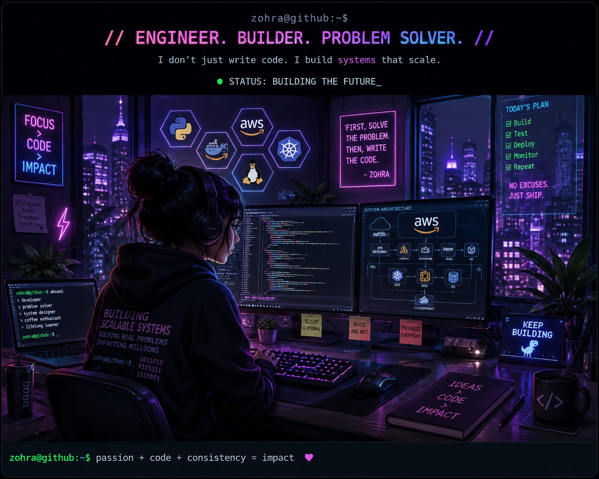

<div align="center">

# ⚡ ZOHRA AHMAD

### SOFTWARE ENGINEER · DISTRIBUTED SYSTEMS · CLOUD INFRASTRUCTURE


<br>

<a href="https://github.com/whyzohra">

</a>

<a href="https://www.linkedin.com/in/zohra-ahmad/">

</a>

<a href="mailto:whyzohra@gmail.com">

</a>

<br><br>


</div>

<br>

<div align="center">



</div>

<br>

<div align="center">

### 🖥️ SYSTEM INITIALIZATION

```text
╭──────────────────────────────────────────────╮
│                                              │
│  zohra@github:~$ ./initialize_profile.sh     │
│                                              │
│  [████████████████████] 100%                 │
│                                              │
│  ✓ Loading developer...                      │
│  ✓ Loading distributed systems...            │
│  ✓ Loading cloud infrastructure...           │
│  ✓ Loading ML systems...                     │
│  ✓ Loading caffeine...                       │
│                                              │
│  ──────────────────────────────────────────  │
│                                              │
│  🟢 SYSTEM STATUS: ONLINE                    │
│                                              │
│  ☁ AWS             CONNECTED                 │
│  ☸ Kubernetes      EXPLORING                 │
│  🐳 Docker         RUNNING                   │
│  🐍 Python         ACTIVE                    │
│  ☕ Java           ACTIVE                    │
│  🧠 ML Systems     BUILDING                  │
│                                              │
│  UPTIME: ∞                                   │
│  COFFEE: ████████████████████ 100%           │
│                                              │
│  zohra@github:~$ _                           │
│                                              │
╰──────────────────────────────────────────────╯
```
</div>
<br>

<h2 align="center">⚡ CURRENTLY BUILDING</h2>

<br>

<table>
<tr>
<td width="50%" valign="top">

<h3>🧠 IN MY HEAD</h3>

```text
┌──────────────────────────────┐
│                              │
│  > Distributed Systems       │
│  > Cloud Infrastructure      │
│  > Reliability Engineering   │
│  > ML Systems                │
│  > Open Source               │
│                              │
│  STATUS: LEARNING...         │
│                              │
└──────────────────────────────┘
```

</td>

<td width="50%" valign="top">

<h3>⚡ CURRENT MISSIONS</h3>

```text
┌──────────────────────────────┐
│                              │
│  [✓] Backend Systems         │
│  [✓] AWS Infrastructure      │
│  [→] Kubernetes              │
│  [→] ML Observability        │
│  [→] Open Source             │
│                              │
│  STATUS: BUILDING...         │
│                              │
└──────────────────────────────┘
```

</td>
</tr>
</table>

<br>

<h3 align="center">🔮 CURRENTLY EXPLORING</h3>

<p align="center">
  <code>Distributed Systems</code> •
  <code>Kubernetes</code> •
  <code>Cloud Infrastructure</code> •
  <code>ML Observability</code> •
  <code>Open Source</code>
</p>

<br>

<div align="center">

```text
╭────────────────────────────────────────────────────────╮
│                                                        │
│  zohra@github:~$ cat /etc/motivation                   │
│                                                        │
│  curiosity > comfort                                   │
│  systems > scripts                                     │
│  building > talking                                    │
│                                                        │
│  zohra@github:~$ _                                     │
│                                                        │
╰────────────────────────────────────────────────────────╯
```

</div>

<br>
<br>

<div align="center">

<h2>🐍 CONTRIBUTION SNAKE</h2>


</div>

<br>
<br>

<h2 align="center">🛠️ TECH STACK</h2>

<br>

<h3 align="center">💻 Languages</h3>

<p align="center">
  
</p>

<br>

<h3 align="center">☁️ Cloud & Infrastructure</h3>

<p align="center">
  
</p>

<br>

<h3 align="center">⚙️ Backend & Systems</h3>

<p align="center">
  
</p>

<br>

<h3 align="center">🧠 Data, ML & Observability</h3>

<p align="center">
  
</p>

<br>

<h3 align="center">🔧 Developer Tools</h3>

<p align="center">
  
</p>

<br>

<div align="center">

```text
╭────────────────────────────────────────────────────────╮
│                                                        │
│  STACK STATUS                                          │
│                                                        │
│  Python          ████████████████████  ACTIVE         │
│  Java            ████████████████████  ACTIVE         │
│  AWS             ████████████████████  PRODUCTION     │
│  Kubernetes      ███████████████░░░░░  EXPLORING      │
│  Docker          ████████████████████  ACTIVE         │
│  ML Systems      ███████████████░░░░░  BUILDING       │
│                                                        │
╰────────────────────────────────────────────────────────╯
```

</div>

<br>
<br>

<h2 align="center">🚀 FEATURED PROJECTS</h2>

<br>

<table align="center">
<tr>

<td width="50%" valign="top">

### ⚡ Distributed Task Orchestrator

Distributed task orchestration system for asynchronous workflows and containerized execution.

`Python` `AsyncIO` `Docker` `REST`

<a href="https://github.com/whyzohra/distributed-task-orchestrator">
View Repository →
</a>

</td>

<td width="50%" valign="top">

### ☁️ EventBridge Automation Pipeline

Cloud-native event automation pipeline built around event-driven workflows and CI/CD.

`Python` `AWS` `Kubernetes` `CI/CD`

<a href="https://github.com/whyzohra/eventbridge-automation-pipeline">
View Repository →
</a>

</td>

</tr>

<tr>

<td width="50%" valign="top">

### 🧠 ML Observability Dashboard

Cloud-native monitoring dashboard for ML workflows and infrastructure observability.

`Python` `Kubernetes` `Monitoring`

<a href="https://github.com/whyzohra/ml-observability-dashboard">
View Repository →
</a>

</td>

<td width="50%" valign="top">

### 🤖 MeetMind AI

AI-powered meeting notes application built with a modern full-stack architecture.

`Next.js` `TypeScript` `AI`

<a href="https://github.com/whyzohra/meetmind-ai">
View Repository →
</a>

</td>

</tr>
</table>

<br>

<br>

<h2 align="center">📊 GITHUB COMMAND CENTER</h2>

<br>

<div align="center">


</div>

<br>

<div align="center">


</div>

<br>

<br>

<h2 align="center">🧩 ENGINEERING PHILOSOPHY</h2>

<br>

<div align="center">

```text
╭────────────────────────────────────────────────────────╮
│                                                        │
│   > DESIGN FOR FAILURE                                 │
│   > AUTOMATE THE BORING                                │
│   > OBSERVE EVERYTHING                                 │
│   > SCALE WITH INTENTION                               │
│   > SHIP. LEARN. ITERATE.                              │
│                                                        │
╰────────────────────────────────────────────────────────╯
```

</div>

<br>

<p align="center">
  <strong>build.</strong>
  &nbsp;•&nbsp;
  <strong>break.</strong>
  &nbsp;•&nbsp;
  <strong>debug.</strong>
  &nbsp;•&nbsp;
  <strong>learn.</strong>
  &nbsp;•&nbsp;
  <strong>repeat.</strong>
</p>

<br>
